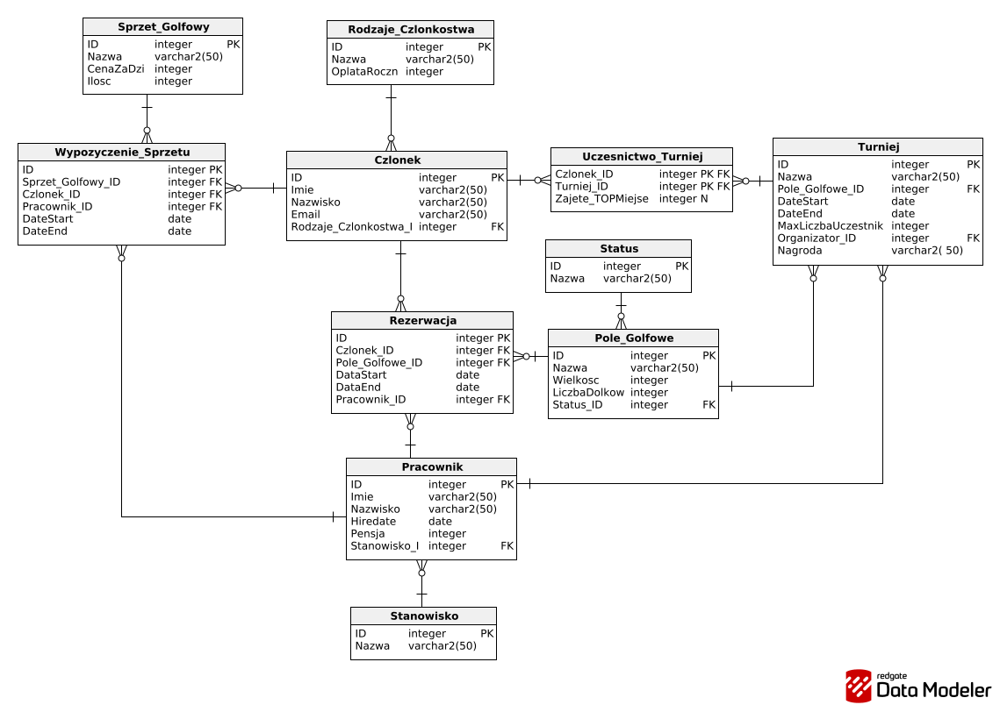

# Golf Club Management Database

## Project Overview
This repository contains a relational database project designed to manage the operations of a golf club. It was built using Oracle SQL and PL/SQL. The system tracks members, employees, golf course reservations, equipment rentals, and tournaments. 

## Database Schema
The database consists of 11 normalized entities. You can see the structure below:

## Repository Structure
* **01_database_setup.sql**: DDL scripts to create tables and set up constraints, followed by DML scripts with sample data for testing.
* **02_analytical_queries.sql**: A set of SQL queries answering specific business questions using JOINs, GROUP BY/HAVING, and correlated subqueries.
* **03_business_logic_triggers.sql**: PL/SQL triggers handling data validation and automated background updates.
* **documentation.docx**: Detailed project requirements and textual description of the entities and relations.
* **erd_diagram.png**: The Entity-Relationship Diagram.

## Technical Details
The project focuses on moving core business logic directly into the database level using PL/SQL triggers:
* **Inventory Updates**: Automatically decreasing or increasing equipment stock when a rental is added or removed.
* **Data Validation**: Blocking reservations for golf courses that are currently under maintenance and validating reservation dates.
* **Safeguards**: Preventing the deletion of equipment that is still physically in stock.
* **Auditing**: Tracking and logging price changes for the rental equipment.

The SQL analytical queries were built to generate basic reports, such as identifying employees earning above the average for their position, tracking active members with multiple tournament entries, and summarizing overall course usage.

## Technologies
* Oracle SQL
* PL/SQL
* Relational Database Design
